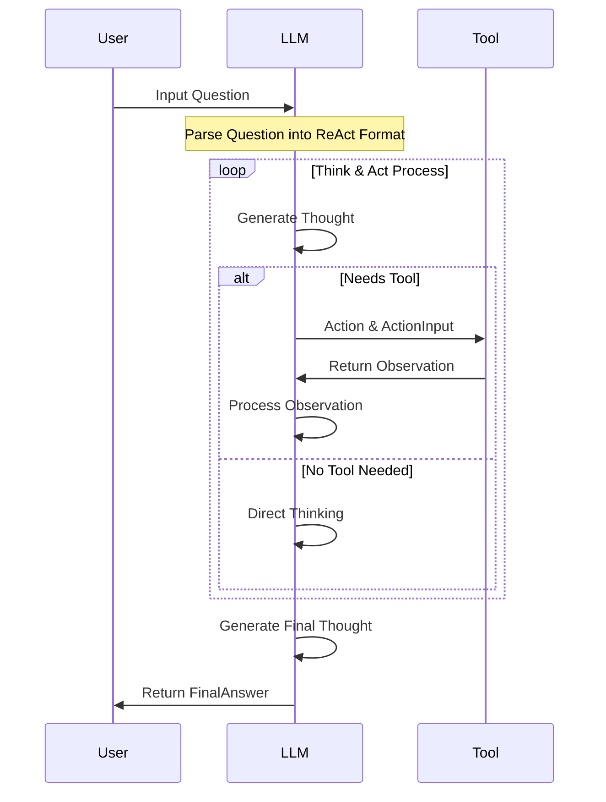

# Overview

Inspired by [Tiny-Agent](https://github.com/KMnO4-zx/TinyAgent).

An agent based on the [ReAct](https://arxiv.org/abs/2210.03629) developed using OpenAI's models, capable of utilizing external search capabilities.

The purpose is to better understand the principles and implementation of [ReAct](https://arxiv.org/abs/2210.03629).

This agent shows:


# Setup & Executing

Apply `Exa.ai` API Key for Web Search: https://dashboard.exa.ai/api-keys

Setup environment：

```bash
conda create -n tiny-react-agent python=3.11
pip install -r requirements.txt
python agent.py
```

Output Example:
```bash
(tiny-react-agent) L@Warren-MBP Tiny-OAI-Agent % python agent.py
Enter your question (type 'exit' to quit): hi

👨‍🍳: hi
🤖Step log...[Thinking]: None; [Action]: None
✨Final Response: Hello! How can I assist you today?

Enter your question (type 'exit' to quit): How's the wearther today in China ShenZhen?

👨‍🍳: How's the wearther today in China ShenZhen?
🤖Step log...[Thinking]: I need to find the current weather in Shenzhen, China.; [Action]: exa_search
🤖Step log...[Thinking]: The current weather in Shenzhen, China is 72°F according to the provided AccuWeather link.; [Action]: None
✨Final Response: The current weather in Shenzhen, China is 72°F.

Enter your question (type 'exit' to quit): Please turn F to C

👨‍🍳: Please turn F to C
🤖Step log...[Thinking]: I need to convert 72 degrees Fahrenheit to Celsius.; [Action]: FinalAnswer
✨Final Response: The temperature 72°F is approximately 22.2°C.

Enter your question (type 'exit' to quit): What is today date? Are US stocks up or down? Please give me the specific data.

👨‍🍳: What is today date? Are US stocks up or down? Please give me the specific data.
🤖Step log...[Thinking]: I need to find out today's date and check the current status of US stock markets.; [Action]: exa_search
🤖Step log...[Thinking]: US stock markets specific data can change rapidly within a single day, so I'll perform a search to gather the latest information.; [Action]: exa_search
🤖Step log...[Thinking]: I have determined the current date and gathered information on US stocks from the latest market trading period.; [Action]: None
✨Final Response: Today's date is March 26, 2025.

As of the last trading day on March 25, 2025, the U.S. stock market showed mixed results:
- The S&P 500 gained 0.13%.
- The Nasdaq Composite gained 0.32%.
- The Dow Jones Industrial Average rose by 0.04%.

Enter your question (type 'exit' to quit): exit
```

**Note**: It cannot be guaranteed that there will be no errors or that the expected results will be obtained every time it runs, because the agent itself is currently unstable, which does not fall under code bugs.
