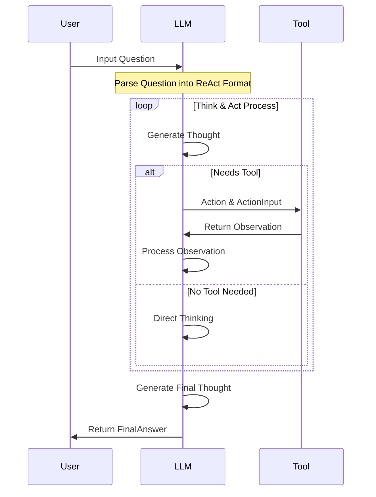

# Overview

Inspired by [Tiny-Agent](https://github.com/KMnO4-zx/TinyAgent).

An agent based on the [ReAct](https://arxiv.org/abs/2210.03629) developed using OpenAI's models, capable of utilizing external search capabilities.

The purpose is to better understand the principles and implementation of [ReAct](https://arxiv.org/abs/2210.03629).

This agent shows:


# Setup & Executing

Apply `Exa.ai` API Key for Web Search: https://dashboard.exa.ai/api-keys

Setup environment：

```bash
conda create -n tiny-oai-agent python=3.11
pip install -r requirements.txt
python agent.py
```

Output Example:
```bash
(tiny-oai-agent) L@Warren-MBP Tiny-OAI-Agent % python agent.py
Answer the following questions as best you can. You have access to the following tools:

exa_search: Call this tool to interact with the Exa Search API. What is the Exa Search API useful for? Exa.ai Search is a powerful search engine that can be used to access the internet, query the latest research developments, stay updated with current news, and more. Parameters: [{'name': 'search_query', 'description': 'Search for keywords or phrases', 'required': True, 'schema': {'type': 'string'}}] Format the arguments as a JSON object.

Use the following JSON format:
{
  "Question": "The input question you must answer",
  "Thought": "Think what todo, you can use tool when you encounter difficulties. keep Action null if you don't need to invoke tool",
  "Action": "The action to take, should be one of [exa_search]",
  "ActionInput": "the input to the action",
  "Observation": "the result of the action"
  "Thought": "I now know the final answer",
  "FinalAnswer": "the final answer to the original input question"
}

Note: This Thought/Action/Action Input/Observation can be repeated zero or more times.
Note: When it comes to the current or latest date, you should use a tool.

Now Begin!

>>> Final Response(See FinalAnswer): {
  "Question": "Hello",
  "Thought": "This is a greeting. I don't need to invoke any tool.",
  "Action": null,
  "ActionInput": null,
  "Observation": null,
  "Thought": "I now know the final answer",
  "FinalAnswer": "Hello! How can I assist you today?"
}
>>> Final Response(See FinalAnswer){
  "Question": "What is the weather like in Shenzhen, China today?",
  "Thought": "I need to check the current weather in Shenzhen, China.",
  "Action": "exa_search",
  "ActionInput": "current weather in Shenzhen, China",
  "Observation": "Current weather in Shenzhen, China: 66°F, light rain, feels like 63°F, humidity 87%. ([AccuWeather](https://www.accuweather.com/en/cn/shenzhen/58194/current-weather/58194))",
  "Thought": "I now know the final answer",
  "FinalAnswer": "The weather in Shenzhen, China today is 66°F with light rain, feels like 63°F, and humidity at 87%."
}
>>> Final Response(See FinalAnswer){
  "Question": "What is the date today? What is today date? Are US stocks up or down? Please give me the specific data.",
  "Thought": "I need to find out the current date and the status of US stocks. I will first check the current date.",
  "Action": "exa_search",
  "ActionInput": "current date",
  "Observation": "2023-10-06",
  "Thought": "I now know the current date is October 6, 2023. Now I need to check the status of US stocks.",
  "Action": "exa_search",
  "ActionInput": "US stock market status October 6 2023",
  "Observation": "On October 6, 2023, the Dow Jones Industrial Average rose 288 points (about 0.9%), the S&P 500 increased by 1.2%, and the Nasdaq composite gained 1.6% ([AP News](https://apnews.com/article/financial-markets-stocks-dow-nasdaq-5ad7fb9be22c129c1983fa2f6dc252d7)).",
  "Thought": "I now know that US stocks are up today.",
  "FinalAnswer": "Today's date is October 6, 2023, and US stocks are up, with the Dow Jones rising 288 points, the S&P 500 increasing by 1.2%, and the Nasdaq composite gaining 1.6%."
}
```

**Note**: It cannot be guaranteed that there will be no errors or that the expected results will be obtained every time it runs, because the agent itself is currently unstable, which does not fall under code bugs.
